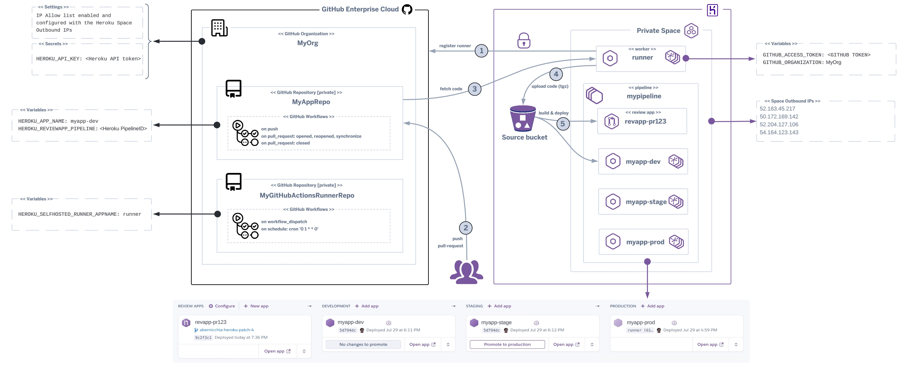

## Heroku-hosted runner for GitHub Actions

This project defines a `Dockerfile` to run a custom Heroku-hosted runner for Github Actions (see also [self-hosted runners](https://docs.github.com/en/actions/hosting-your-own-runners/about-self-hosted-runners)).

The runner is hosted on [Heroku as a docker image](https://devcenter.heroku.com/articles/build-docker-images-heroku-yml) via `heroku.yml`.

## How it works

Once the self-hosted runner is running on Heroku you can start adding workflows to your private GitHub repositories to automate Heroku Review Apps creation and Heroku Apps deploys using the following action (that includes worflows examples):
- https://github.com/heroku-reference-apps/github-heroku-flow-action



The Heroku-hosted runner will autoregister with your GitHub Org **(1)**. When git push / pull-request commands are executed toward your private GitHub repository **(2)** your workflows will trigger the code fetch from your repository **(3)**.<br/>
The source code will be automatically compressed and uploaded to a temporary Heroku bucket **(4)** then built and deployed to your apps **(5)**. When a pull request is created a new Review App is created and once it is closed the associated Review App is automatically removed.


## Disclaimer
The author of this article makes any warranties about the completeness, reliability and accuracy of this information. **Any action you take upon the information of this website is strictly at your own risk**, and the author will not be liable for any losses and damages in connection with the use of the website and the information provided. **None of the items included in this repository form a part of the Heroku Services.**

## Quick Start

**Things you'll need**

- Administrator access to your GitHub organization
- Administrator access to your Heroku organization
- GitHub personal access token (classic) with **admin:org** and **repo** scopes or fine-grained token with **"Self-hosted runners" organization permissions (read and write)** (see https://docs.github.com/en/enterprise-cloud@latest/rest/actions/self-hosted-runners?apiVersion=2022-11-28#create-a-registration-token-for-an-organization)
- Heroku API token from a non-SSO user (service/automation user) with **view** and **deploy** access
- [Heroku CLI](https://devcenter.heroku.com/articles/heroku-cli)
- [Git CLI](https://git-scm.com/)

The setup requires configurations in both your GitHub organization and your Heroku organization.

You will switch between them throughout the following instructions.

1. In GitHub, enable GitHub Actions for your organization
    - https://github.com/organizations/{YOUR_ORGANIZATION}/settings/actions
    - Under **Policies**
        - Choose **Allow {YOUR_ORGANIZATION}, and select non-{YOUR_ORGANIZATION}, actions and reusable workflows**
        - Select **Allow actions created by GitHub**
        - Click **Save**

2. In GitHub, add your Heroku Private Space's outbound IP addresses to your organization's allow list (see this [article](https://docs.github.com/en/enterprise-cloud@latest/organizations/keeping-your-organization-secure/managing-security-settings-for-your-organization/managing-allowed-ip-addresses-for-your-organization#adding-an-allowed-ip-address)) and check the **Enable IP allow list** box
    - https://github.com/organizations/{YOUR_ORGANIZATION}/settings/security

3. In GitHub, create a personal access token with **admin:org** and **repo** scopes (see these articles [1](https://docs.github.com/en/enterprise-server@3.9/authentication/keeping-your-account-and-data-secure/managing-your-personal-access-tokens#creating-a-personal-access-token), [2](https://docs.github.com/en/rest/actions/self-hosted-runners?apiVersion=2022-11-28#create-a-registration-token-for-an-organization)) or a fine-grained token with **"Self-hosted runners" organization permissions (read and write)** (see https://github.blog/security/application-security/introducing-fine-grained-personal-access-tokens-for-github/#creating-personal-access-tokens). This token will be used only to configure the runner. Authenticated users must have admin access to the organization. (see https://docs.github.com/en/enterprise-cloud@latest/rest/actions/self-hosted-runners?apiVersion=2022-11-28#create-a-registration-token-for-an-organization). 
    > Don't forget to authorize your access token to SSO to your organization

4. In Heroku, create a new app in your private space

5. In Heroku, add the following configuration variables to the new app
    - `GITHUB_ACCESS_TOKEN` [required] with the token you created previously
    - `GITHUB_ORGANIZATION` [required] with the name of your organization
    - `GITHUB_RUNNER_LABELS` [optional] custom labels that will be added to the runner (e.g. L1,L2,L3)
    - `GITHUB_RUNNER_GROUP` [optional] name of the runner group to add the runner to (see also this [article](https://docs.github.com/en/actions/hosting-your-own-runners/managing-self-hosted-runners/managing-access-to-self-hosted-runners-using-groups#creating-a-self-hosted-runner-group-for-an-organization))


6. From the Heroku CLI login as the service/automation Heroku user to create an API token (SSO users cannot create tokens)

7. Generate a new Heroku API key
    - `heroku authorizations:create -d "GitHub self-hosted actions automation" --expires-in=<set expiration time in seconds>` setting an adequate expiration time

8. Login as the Heroku administrator and grant the service/automation Heroku user access to **view** and **deploy** to your new app
    - https://dashboard.heroku.com/apps/{YOUR_APP}/access

9. In GitHub, add an organization secret to store the Heroku information
    - https://github.com/organizations/{YOUR_ORGANIZATION}/settings/secrets/actions
    - `HEROKU_API_KEY` with the api key you created previously

10. In GitHub, add an organization/repository variable to store the Heroku self-hosted runner app name
    - https://github.com/organizations/{YOUR_ORGANIZATION}/settings/variables/actions
    - https://github.com/{YOUR_ORGANIZATION}/{YOUR_REPOSITORY}/settings/variables/actions
    - `HEROKU_SELFHOSTED_RUNNER_APPNAME` with the name of the Heroku self-hosted runner app

11. Locally, clone and deploy this repository to your Heroku app or click on the Heroku Button

    [](https://heroku.com/deploy)

    ```shell
    git clone https://github.com/abernicchia-heroku/heroku-github-actions-runner.git
    heroku git:remote --app HEROKU_SELFHOSTED_RUNNER_APPNAME
    heroku apps:stacks:set --app HEROKU_SELFHOSTED_RUNNER_APPNAME container
    git push heroku main
    ```

12. In Heroku, scale your **runner** resource appropriate for your expected usage
    - https://dashboard.heroku.com/apps/{YOUR_APP}/resources
    - A single dyno can run one GitHub Actions job at a time
    - Recommended: Private-M dyno type scaled to 4 dynos

Voila!

Now when GitHub Action workflows are launched by your repositories, GitHub will orchestrate
with your Heroku-hosted runner to do the work just as if you were using GitHub-hosted runners.

## Keeping Your Runner Updated

GitHub frequently releases updates to the GitHub Action runner package.

If you don't keep the package up-to-date within 30 days then [GitHub won't enqueue jobs](https://docs.github.com/en/actions/hosting-your-own-runners/managing-self-hosted-runners/autoscaling-with-self-hosted-runners#controlling-runner-software-updates-on-self-hosted-runners).

This project includes a workflow that can be run manually or once a week. It will rebuild the docker container
and download the latest updates automatically and it will deploy automatically to your Heroku self-hosted runner app.

To take advantage of this automation you need to [fork](https://docs.github.com/en/pull-requests/collaborating-with-pull-requests/working-with-forks/fork-a-repo) or [mirror](https://docs.github.com/en/repositories/creating-and-managing-repositories/duplicating-a-repository#mirroring-a-repository-in-another-location) this repository to your private organisation's repository and enable workflows run.

## GitHub Runner Script Usage

The following is how to use the `config.sh` and `run.sh` scripts installed by the runner package (see https://github.com/actions/runner/blob/main/src/Runner.Listener/Runner.cs).

```
Commands:
 ./config.sh         Configures the runner
 ./config.sh remove  Unconfigures the runner
 ./run.sh            Runs the runner interactively. Does not require any options.

Options:
 --help     Prints the help for each command
 --version  Prints the runner version
 --commit   Prints the runner commit
 --check    Check the runner's network connectivity with GitHub server

Config Options:
 --unattended           Disable interactive prompts for missing arguments. Defaults will be used for missing options
 --url string           Repository to add the runner to. Required if unattended
 --token string         Registration token. Required if unattended
 --name string          Name of the runner to configure (default hostname on Linux - from C# Environment.MachineName)
 --runnergroup string   Name of the runner group to add this runner to (defaults to the default runner group)
 --labels string        Custom labels that will be added to the runner. This option is mandatory if --no-default-labels is used.
 --no-default-labels    Disables adding the default labels: e.g. 'self-hosted,Linux,X64'
 --local                Removes the runner config files from your local machine. Used as an option to the remove command
 --work string          Relative runner work directory (default _work)
 --replace              Replace any existing runner with the same name (default false)
 --pat                  GitHub personal access token with repo scope. Used for checking network connectivity when executing `./run.sh --check`
 --disableupdate        Disable self-hosted runner automatic update to the latest released version`
 --ephemeral            Configure the runner to only take one job and then let the service un-configure the runner after the job finishes (default false);

Examples:
 Check GitHub server network connectivity:
  ./run.sh --check --url <url> --pat <pat>

 Configure a runner non-interactively:
  ./config.sh --unattended --url <url> --token <token>

 Configure a runner non-interactively, replacing any existing runner with the same name:
  ./config.sh --unattended --url <url> --token <token> --replace [--name <name>]

 Configure a runner non-interactively with three extra labels:
  ./config.sh --unattended --url <url> --token <token> --labels L1,L2,L3;
```

## Technical Notes
This new release:
- uses a new [GitHub Action](abernicchia-heroku/heroku-flow-action) to build and deploy the runner on Heroku using the [sources endpoint API](https://devcenter.heroku.com/articles/build-and-release-using-the-api#sources-endpoint). This action allows you to deploy code living on GitHub repositories, even private, to apps running on Heroku without requiring the [Heroku GitHub integration](https://devcenter.heroku.com/articles/github-integration)
- uses ephemeral containers to allow [autoscaling](https://docs.github.com/en/actions/hosting-your-own-runners/managing-self-hosted-runners/autoscaling-with-self-hosted-runners#using-ephemeral-runners-for-autoscaling) and [hardening](https://docs.github.com/en/actions/security-guides/security-hardening-for-github-actions#hardening-for-self-hosted-runners) of self-hosted runners. Ephemeral runners are short-lived containers that are executed only once for a single job, providing isolated environments to reduce the risk of data leakage
- uses a [base image](https://devcenter.heroku.com/articles/stack) that is curated and maintained by Heroku
- logs the self-runner name to manage it from the GitHub dashboard
- reduces the Docker image footprint and it's possible to run it as one-off dyno (CMD vs. ENTRYPOINT)
- includes all the recent GitHub self-hosted runners features and streamlines the configuration and setup
- integrates the [Heroku Button](https://www.heroku.com/elements/buttons) to install the runner in one-click
- supports fine-grained GitHub tokens

## Credits
Credits to the [owner](https://github.com/douglascayers/heroku-github-actions-runner) of the original project that inspired this new updated version.
 